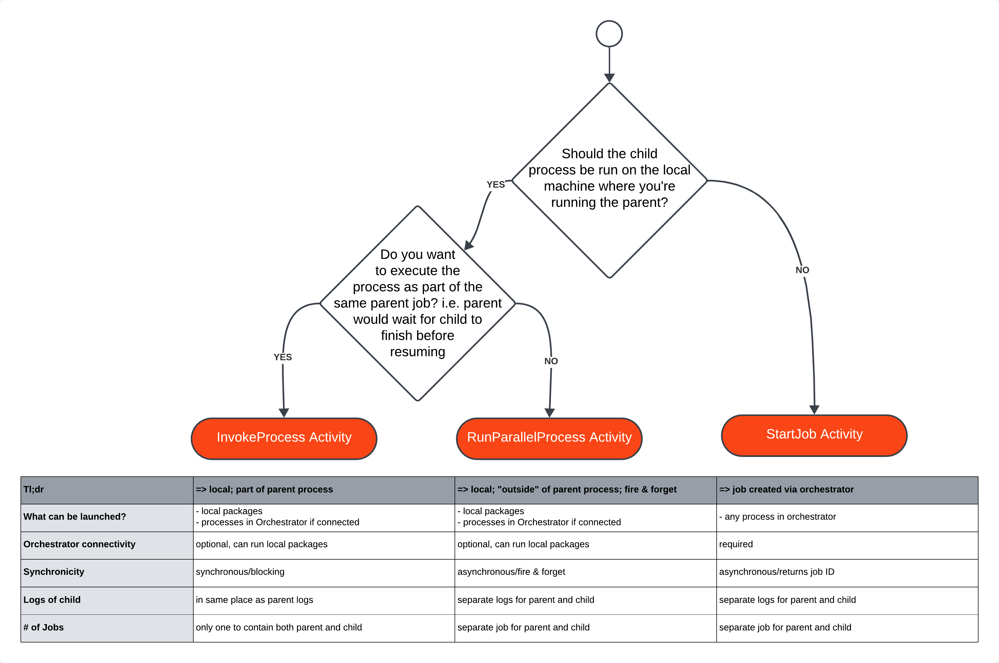

There are two Studio projects, the "Parent" project and the "Child" project. To illustrate that processes can be invoked across compatibilities, the Parent project is Windows compatibility, the Child project is Windows-legacy compatibility.

To get the demo running follow these (high-level) steps below:
TODO make the steps more granular and link to documentation

1. Clone the project from Github (you can also do this with the built-in Studio Git functionality).
2. Set up Orchestrator
   - For isolation and easier visibility in the logs, set up a separate folder to run this demo in.
   - Set up an unattended machine with a runtime and a robot user and add it to the folder you created.
3. Publish the Child project to the Orchestrator folder you created.
   - Create 3 separate processes for the 3 separate entry points (child1, child2, child3) that are in the package you just published.
4. Open the Parent project and Run/Debug any of the three scenarios (InvokeProcess, RunParallelProcess, StartJob)
   - As you run/debug the project, you can check the output as well as the logs on orchestrator to understand how the 3 process chaining activities work.

How to decide which Process Chaining activity to use?

