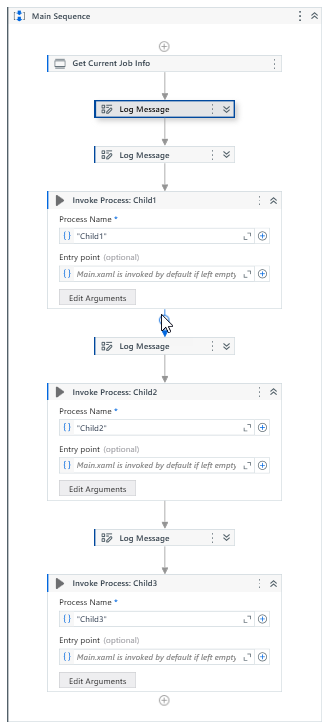
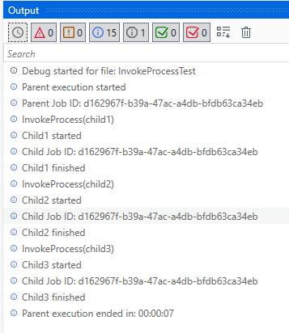
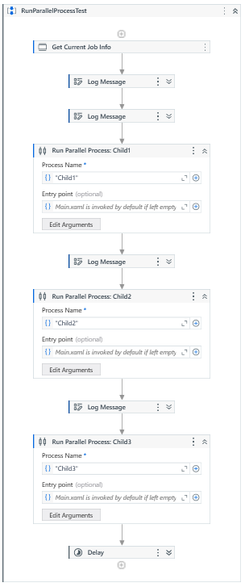
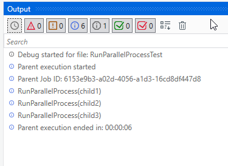
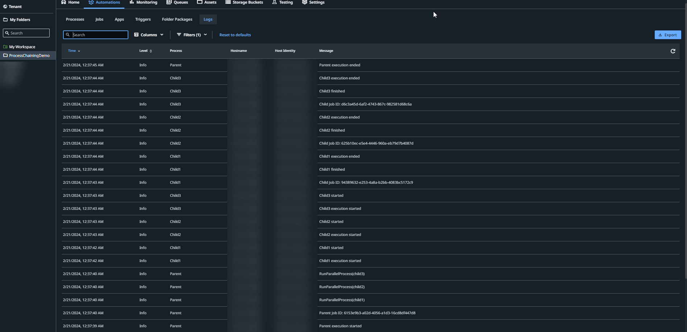
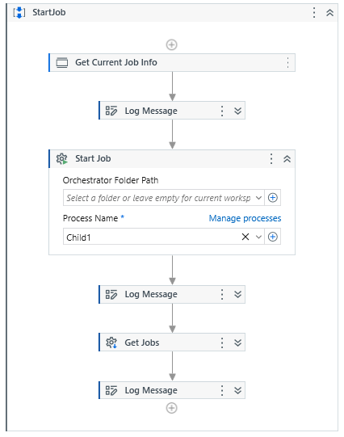
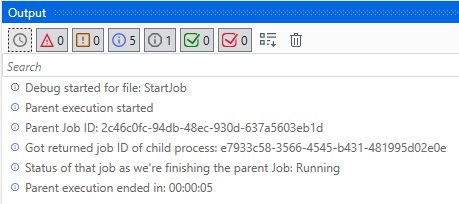
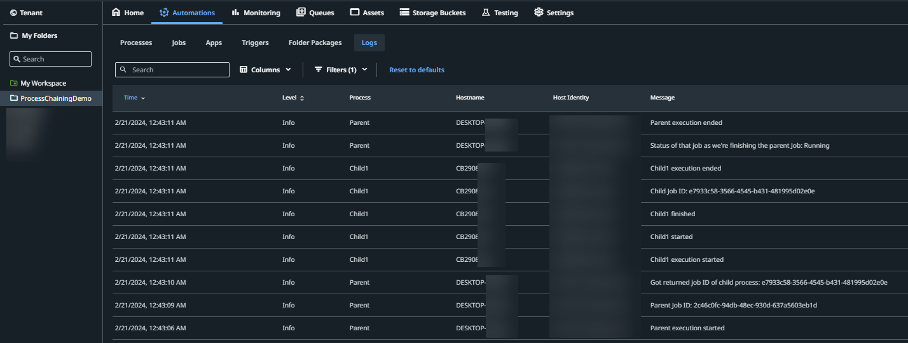

There are two Studio projects, the "Parent" project and the "Child" project. To illustrate that processes can be invoked across compatibilities, the Parent project is Windows compatibility, the Child project is Windows-legacy compatibility.

# Installing the demo

To get the demo running follow these (high-level) steps below:

TODO make the steps more granular and link to documentation

1. Clone the project from Github (you can also do this with the built-in Studio Git functionality).
2. Set up Orchestrator
   - For isolation and easier visibility in the logs, set up a separate folder to run this demo in.
   - Set up an unattended machine with a runtime and a robot user and add it to the folder you created.
3. Publish the Child project to the Orchestrator folder you created.
   - Create 3 separate processes for the 3 separate entry points (child1, child2, child3) that are in the package you just published.
4. Open the Parent project and Run/Debug any of the three scenarios (InvokeProcess, RunParallelProcess, StartJob)
   - As you run/debug the project, you can check the output as well as the logs on orchestrator to understand how the 3 process chaining activities work.

# How to decide which Process Chaining activity to use?

UiPath documentation for the three activities:
- https://docs.uipath.com/activities/other/latest/workflow/invoke-process
- https://docs.uipath.com/activities/other/latest/workflow/begin-process (now called "RunParallelProcess")
- https://docs.uipath.com/activities/other/latest/workflow/start-job

# Screenshots
run with Studio 2023.10.4 and Automation Cloud

## InvokeProcess

## RunParallelProcess

## StartJob

# Callouts about the demo setup
- The child project is configured as background process (project settings in studio > starts in background), otherwise you will get an error when trying to run them as parallel processes on the same machine in the same thread (e.g. without PiP)
- All three workflow xaml files inside the child project are configured as entry points (right click > enable entry point) so that we can create separate processes from them.
